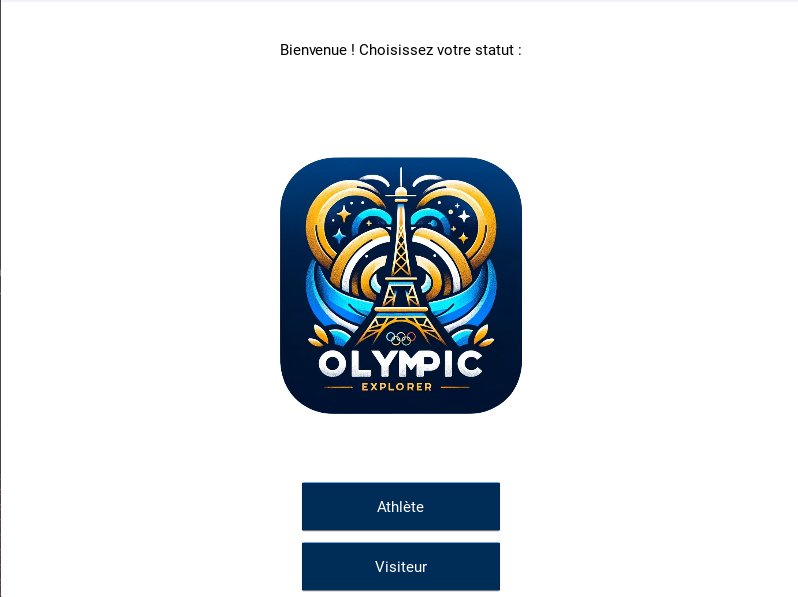

# Olympic Explorer

Olympic Explorer is a cross-platform mobile/desktop application built with [Kivy](https://kivy.org/) that helps athletes and visitors navigate the Paris 2024 Olympic Games. It combines event browsing, real-time weather data, and an AI assistant module to provide personalized recommendations and motivational guidance.

## Table of Contents

- [Features](#features)
- [Screens](#screens)
- [Demo](#demo)
- [Installation](#installation)
- [Configuration](#configuration)
- [Usage](#usage)
- [Project Structure](#project-structure)
- [Dependencies](#dependencies)
- [Database Schema](#database-schema)
- [API Keys](#api-keys)
- [Contributing](#contributing)

## Features

- **User Roles**: Choose between Athlete or Visitor mode on launch.
- **Event Browser**: Search, filter (by sport, date, venue), and paginate through Olympic events stored in a MySQL database.
- **Event Visualization**: Dynamically generate event cards by overlaying text and stadium images onto a background template.
- **Selection & Details**: Select events of interest to build a custom itinerary; view event summaries.
- **Weather Integration**: Fetch live weather for selected host cities via the OpenWeatherMap API.
- **AI Assistant**: Chat with an AI powered by OpenAI's Chat API, providing training tips for athletes or travel recommendations for visitors.

## Screens

1. **Permission Screen** (`EcranPermission`)
   - Lets the user declare their role: Athlete or Visitor.

2. **Event Screen** (`EcranMeteo` / `EcranMeteo2`)
   - Visitor mode: browse all events.
   - Athlete mode: browse events for a chosen sport.
   - Includes text search, spinners for sport/date/venue filters, and pagination controls.

3. **Sport Selector** (`Sportchoisir`)
   - Athletes select their sport before viewing filtered events.

4. **Weather Screen** (`Weatherscreen`)
   - Displays temperature, feels‑like, min/max, humidity for each selected city.
   - Navigate between multiple cities.

5. **AI Chat Screen** (`EcranAI`)
   - Converse with the AI assistant for motivation, training plans, or travel tips.
   - Rich chat UI with user/AI message bubbles and loading animations.

## Demo



## Installation

1. **Clone the repository**:
   ```bash
   git clone https://github.com/<your-username>/OlympicExplorer.git
   cd OlympicExplorer
   ```

2. **Create a virtual environment** (recommended):
   ```bash
   python3 -m venv venv
   source venv/bin/activate   # On Windows: venv\Scripts\activate
   ```

3. **Install dependencies**:
   ```bash
   pip install -r requirements.txt
   ```

Configuration
MySQL Database (via XAMPP)
Start XAMPP

Launch the XAMPP Control Panel.

Start Apache and MySQL.

Open phpMyAdmin

In your browser, go to:

arduino
Copy
Edit
http://localhost/phpmyadmin
Create the database

In phpMyAdmin’s sidebar, click New.

Enter jeux_olympiques as the database name and click Create.

Import the provided SQL dump

Select your new jeux_olympiques database in the sidebar.

Go to the Import tab.

Click Choose File, select jeux_olympiques.sql from your project folder, then click Go.

phpMyAdmin will execute the script and populate the evenements table with all event data.

Verify credentials

By default XAMPP’s MySQL user is root with no password.

Make sure in your main.py (or wherever you connect) you have:

python
Copy
Edit
self.db_connection = mysql.connector.connect(
    host="localhost",
    user="root",
    password="",
    database="jeux_olympiques"
)
Assets & API keys

Place your images in img/autre/ and img/stades/ as before.

Update your OpenWeatherMap and OpenAI keys in the code (see the API Keys section).
## Usage

Run the app:
```bash
python main.py   # or python olympic_explorer.py
```

The app will open a window where you can select your role and begin exploring events.

## Project Structure

```
OlympicExplorer/
├── img/
│   ├── autre/           # UI and icon images
│   └── stades/          # Stadium photos for overlays
├── font.ttf             # Font for image text overlays
├── main.py              # Entry point and App class
├── screens/             # (optional) Split classes per file
│   ├── permission.py
│   ├── events.py
│   └── chat.py
├── requirements.txt     # Python dependencies
└── README.md
```

## Dependencies

- [Kivy](https://kivy.org/)
- [Pillow](https://python-pillow.org/)
- [mysql-connector-python](https://pypi.org/project/mysql-connector-python/)

## Database Schema

| Column    | Type    | Description                  |
|-----------|---------|------------------------------|
| id        | INT     | Primary key                  |
| evenement | VARCHAR | Sport discipline             |
| event_name| VARCHAR | Official event name          |
| date      | DATE    | Event date                   |
| time      | TIME    | Event start time             |
| stades    | VARCHAR | Stadium/location name        |
| villes    | VARCHAR | Host city                    |

## API Keys
- **OpenAI**: Obtain your key at https://platform.openai.com and set it in `EcranAI.get_ai_response`.

## Contributing

Contributions, issues, and feature requests are welcome! Feel free to open a pull request.
